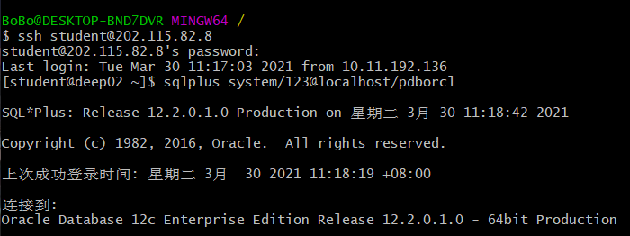
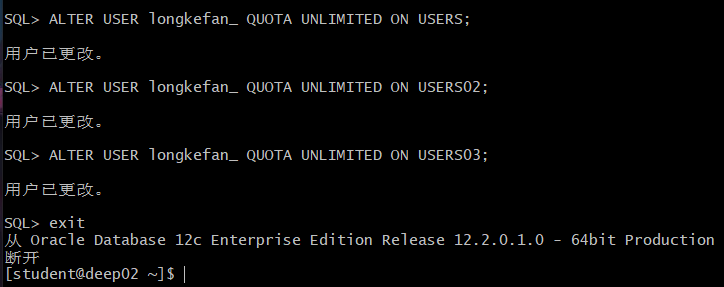
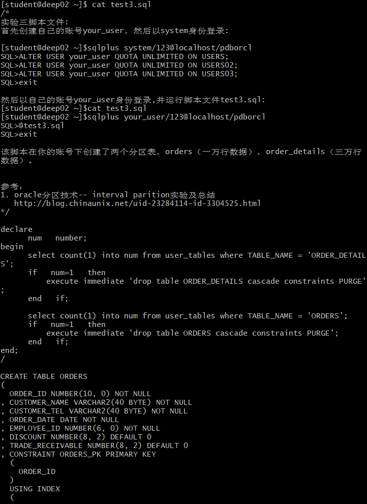
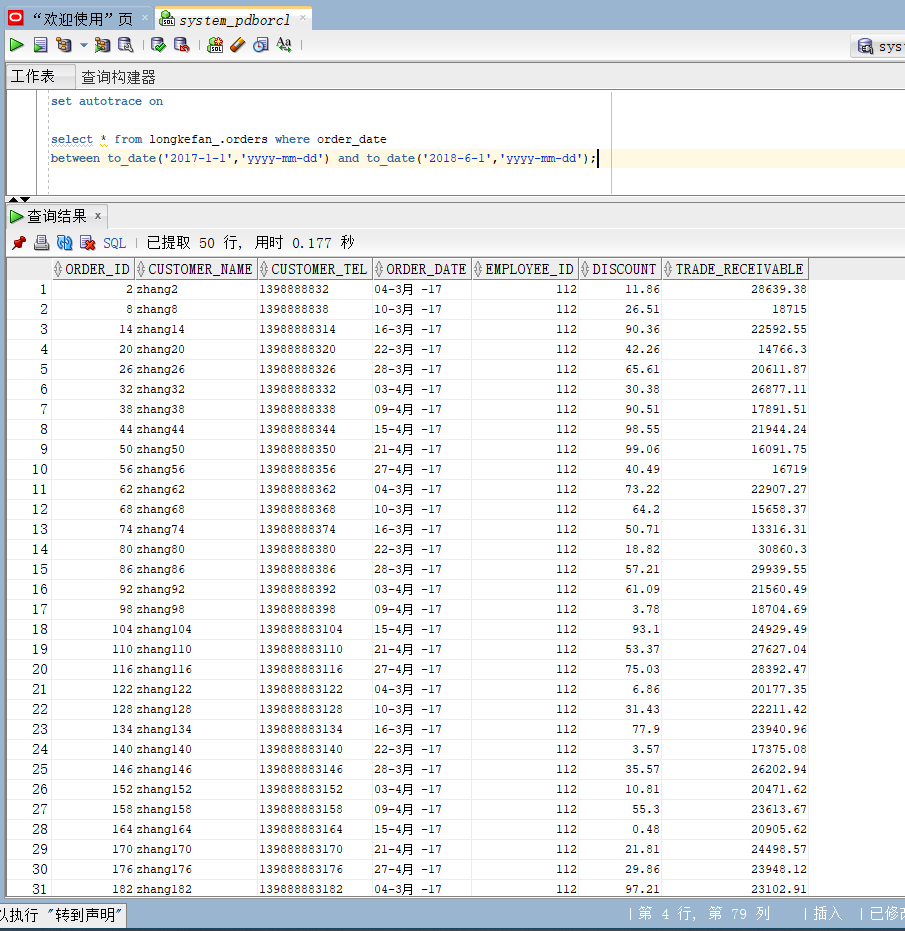
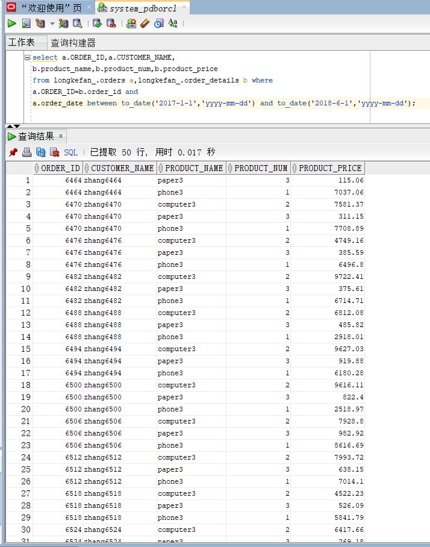

# 实验3：创建分区表

## 实验目的：

掌握分区表的创建方法，掌握各种分区方式的使用场景。

## 实验内容：
- 本实验使用3个表空间：USERS,USERS02,USERS03。在表空间中创建两张表：订单表(orders)与订单详表(order_details)。
- 使用**你自己的账号创建本实验的表**，表创建在上述3个分区，自定义分区策略。
- 你需要使用system用户给你自己的账号分配上述分区的使用权限。你需要使用system用户给你的用户分配可以查询执行计划的权限。
- 表创建成功后，插入数据，数据能并平均分布到各个分区。每个表的数据都应该大于1万行，对表进行联合查询。
- 写出插入数据的语句和查询数据的语句，并分析语句的执行计划。
- 进行分区与不分区的对比实验。

## 实验参考步骤
 ##### 首先创建自己的账号longkefan_，然后以system身份登录:

```sql
[student@deep02 ~]$sqlplus system/123@localhost/pdborcl
SQL>ALTER USER longkefan_ QUOTA UNLIMITED ON USERS;
SQL>ALTER USER longkefan_ QUOTA UNLIMITED ON USERS02;
SQL>ALTER USER longkefan_ QUOTA UNLIMITED ON USERS03;
SQL>exit
```
 ##### 运行结果



 ##### 然后以自己的账号longkefan_身份登录,并运行脚本文件test3.sql:
```sql
[student@deep02 ~]$cat test3.sql
[student@deep02 ~]$sqlplus longkefan_/123@localhost/pdborcl
SQL>@test3.sql
SQL>exit
```
 ##### 运行结果

.png)

```text
该脚本在你的账号下创建了两个分区表，orders（一万行数据），order_details（三万行数据）。
```
##### 以system用户运行：
```sql
set autotrace on

select * from longkefan_.orders where order_date
between to_date('2017-1-1','yyyy-mm-dd') and to_date('2018-6-1','yyyy-mm-dd');
```
##### 运行结果


```sql
select a.ORDER_ID,a.CUSTOMER_NAME,
b.product_name,b.product_num,b.product_price
from longkefan_.orders a,longkefan_.order_details b where
a.ORDER_ID=b.order_id and
a.order_date between to_date('2017-1-1','yyyy-mm-dd') and to_date('2018-6-1','yyyy-mm-dd');
```
##### 运行结果
